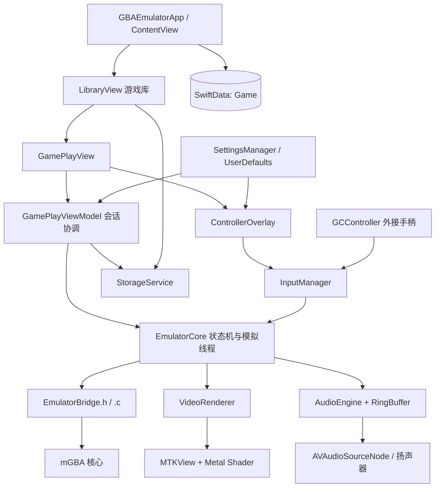
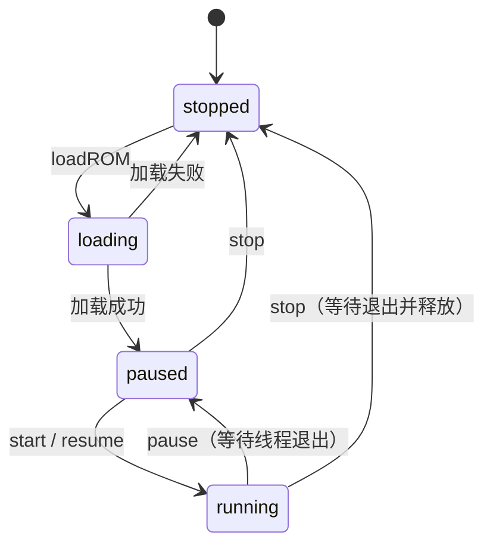

# GBA Emulator：架构与核心逻辑

> 本文依据当前仓库的 Swift、C、Metal 源码及 `project.yml` 整理，描述已经实现的调用链；预留接口和未接通的功能会单独标注。文中的路径均相对仓库根目录。本文是源码说明，不代表已完成真机运行或性能验证。

## 1. 项目定位

这是一个面向 **iOS 17+** 的原生 GBA 模拟器：

- **SwiftUI**：游戏库、游戏界面、触屏手柄、暂停菜单和设置。
- **mGBA 0.10.3**：负责 GBA CPU、内存、图形、声音及游戏硬件的模拟。
- **手写 C 桥接层**：把 mGBA 的结构体和函数指针封装成 Swift 可调用的 C API。
- **Metal**：将 mGBA 生成的 240 × 160 像素帧显示到屏幕。
- **AVAudioEngine**：播放模拟器产生的立体声音频。
- **SwiftData / UserDefaults / 文件系统**：分别存游戏元数据、设置、ROM 与存档。

**关键理解：Swift 不实现 GBA 指令或硬件模拟，Metal 也不负责模拟 GBA 图形硬件。** mGBA 已经算出游戏画面和音频；Swift 层负责调度、交互、呈现和持久化。

当前构建只开启 GBA 核心，关闭 GB 核心；应用导入入口只接受 `.gba`，不能因为使用 mGBA 就认为已经支持 GB/GBC。

## 2. 总体架构



### 2.1 分层与职责

| 层次 | 主要文件 | 负责什么 |
| --- | --- | --- |
| 应用入口 | `GBAEmulator/GBAEmulatorApp.swift` | 初始化唯一的 ModelContainer、管理游戏页面与外部文件打开事件 |
| 游戏库 | `GBAEmulator/Features/Library/LibraryView.swift` | 查询、搜索、最近游玩、网格/列表、导入、收藏、删除、启动游戏 |
| 游戏会话 | `GBAEmulator/Features/GamePlay/GamePlayView.swift` | View 展示；同文件中的 ViewModel 组装组件并协调生命周期、快进与存档 |
| 交互 UI | `GBAEmulator/Features/GamePlay/{ControllerOverlay,PauseMenuView}.swift` | 触屏按钮、暂停菜单、存档槽位界面 |
| 模拟调度 | `GBAEmulator/Core/Emulator/EmulatorCore.swift` | ROM 生命周期、后台逐帧执行、安全暂停/停止、存读档与截图 |
| 核心适配 | `GBAEmulator/Core/Emulator/EmulatorBridge.{h,c}` | 封装 mGBA，管理 C 上下文、视频/音频缓冲区及序列化接口 |
| 音视频 | `GBAEmulator/Core/Emulator/{VideoRenderer,MetalView,AudioEngine,RingBuffer}.swift`、`Shaders.metal` | 画面拷贝与 GPU 显示、音频缓存与输出 |
| 输入 | `GBAEmulator/Core/Input/InputManager.swift` | 合并触屏与外接手柄状态，提供每帧按键位掩码 |
| 数据与服务 | `GBAEmulator/Models/`、`GBAEmulator/Services/` | 游戏模型、设置、文件路径、导入删除、触感反馈 |
| 存档辅助 | `GBAEmulator/Core/SaveState/SaveStateManager.swift` | 槽位列表、删除、锁定元数据；目前未成为游戏页面实际使用的管理入口 |

项目采用的是 **SwiftUI + 局部 MVVM + 核心服务组件**，不是每个页面都有独立 ViewModel。例如游戏库的导入和删除逻辑仍在 View 内。

### 2.2 对象所有权

`GamePlayView` 通过 `@StateObject` 持有 `GamePlayViewModel`。每个 ViewModel 创建自己的：

- `InputManager`
- `AudioEngine`
- `VideoRenderer`
- `EmulatorCore`
- `SaveStateManager`（已实例化，但没有调用其管理方法）

因此 SwiftUI 重建 View 不会重新创建当前会话的 renderer 和模拟核心。`EmulatorCore` 持有 C 上下文；后台线程捕获所需组件和指针包装，而不长期强引用 MainActor 上的 Core 对象。

## 3. 从导入 ROM 到开始运行

### 3.1 应用启动与数据入口

1. `GBAEmulatorApp.init()` 创建 `ModelContainer(for: Game.self)`，失败时直接 `fatalError`。
2. 将 container 注入 `ContentView`。
3. `LibraryView` 使用 `@Query` 按 `Game.lastPlayed` 倒序取游戏，再进行搜索过滤，取最近玩过的 5 个游戏展示。
4. `ContentView.selectedGame` 非空时，通过 `fullScreenCover` 打开游戏页面。

ROM 有两个入口：

- 游戏库的文件选择器：允许批量导入 `.gba`，导入后留在游戏库。
- 外部文件打开：`onOpenURL` 检查扩展名，将 URL 交给游戏库；导入并显式保存 SwiftData 后自动启动。

### 3.2 文件导入

`StorageService.importROM(from:)` 的顺序是：

```text
创建 Documents 下的基础目录
  → 计算目标文件名
  → 重名时添加 _1、_2…（不覆盖旧 ROM）
  → 获取 security-scoped 文件访问权限
  → 复制文件到 Documents/ROMs/
  → 读取文件大小并归还访问权限
  → LibraryView 创建并插入 Game
```

游戏标题来自文件名：移除扩展名，并将 `_`、`-` 替换为空格；不是导入时读取 ROM 内部标题。当前没有内容哈希去重，同一 ROM 可以作为不同文件重复导入。

点击游戏时更新 `lastPlayed`、尝试保存 modelContext，然后设置 `selectedGame`。外部导入路径额外确保模型保存成功后再启动，避免直接使用临时模型身份作为存档目录依据。

### 3.3 游戏初始化

`GamePlayView.onAppear` 调用 `startGame()`：

```text
EmulatorCore.loadROM(game.romURL)
  → stop() 清理旧会话
  → state = loading
  → emulator_create() 分配上下文和缓冲区
  → emulator_load_rom() 创建、初始化 mGBA 并加载 ROM
  → 绑定 Saves/<ROM基础名>.sav
  → 设置音频输出采样率、跳过 BIOS
  → state = paused

若 auto.state 存在：尝试读取
  → EmulatorCore.start()
  → 启动音频与模拟线程
  → 记录游玩开始时间
```

C 层加载使用 `mCoreFind → core->init → mCoreInitConfig → setVideoBuffer → setAudioBufferSize → loadROM → reset`，随后读取标题和游戏代码。日志等级限制为 fatal/error，减少异常 ROM 高频日志带来的开销。

**自动恢复的当前语义**：只要 `auto.state` 存在就尝试加载，不检查自动存档开关；失败返回值被忽略，继续运行 ROM。

## 4. 模拟状态机与生命周期

### 4.1 状态机



- `stopped`：没有运行中的会话，停止后释放 C 上下文。
- `loading`：同步执行核心创建和 ROM 加载。
- `paused`：保留 C 上下文，但没有运行中的模拟线程。
- `running`：后台线程持续推进游戏帧。

恢复不是唤醒旧线程，而是为保留的上下文启动一个新 `Thread`。

### 4.2 页面与系统事件

| 事件 | 当前行为 |
| --- | --- |
| 点击暂停 | 清空触屏按键，等待模拟线程退出，暂停音频，累计本段游玩时间 |
| 点击继续 | 启动模拟线程与音频，重新记录游玩开始时间 |
| `.inactive` | 暂停，不在这个分支写自动存档 |
| `.background` | 先暂停，再按开关写自动存档 |
| `.active` | 不自动恢复，需要用户点击继续 |
| 返回游戏库 / 页面消失 | 暂停、按开关自动存档、停止核心；重复 stop 有保护 |

`totalPlayTime` 统计实际前台运行区间的墙钟时间，不是快进后的游戏内部时间。暂停时结算，暂停期间不累计。

## 5. 核心热路径：每一帧做什么

后台线程名为 `com.gbaemulator.emulation`，QoS 为 `.userInteractive`。

```text
while running 且线程未取消:
    1. 记录本帧开始时间
    2. InputManager.pollInput() 合并输入
    3. emulator_set_keys() 将按键写入 mGBA
    4. emulator_run_frame() 推进一个完整 GBA 帧
    5. VideoRenderer.updateFrame() 拷贝画面
    6. 取出当前音频帧，交给 AudioEngine
    7. 根据倍速计算剩余时间，先 sleep，再短时间忙等
```

### 5.1 帧率与快进

原生目标帧率为 **59.7275 Hz**，每帧预算约 **16.742 ms**：

```text
目标帧时长 = (1 / 59.7275) / speed
剩余等待时间 = 目标帧时长 - 当前帧已耗时
```

- 设置支持 `2...10` 的全部整数倍速；运行循环将速度限制在 `1...10`。
- 快进增加单位墙钟时间内执行的游戏帧数，不修改 GBA 的模拟时钟语义。
- 若本帧执行已经超过预算，就不等待；实际倍速受设备性能限制。
- 当前粗粒度 sleep 后预留的忙等区间：速度不超过 2 倍时为 1.5 ms，其余为 1 ms。不要将旧注释中的“最多 0.5 ms”当成实际实现。
- 循环没有基于音频水位的自适应同步，也没有独立的模拟跳帧策略。

`CADisplayLink` 相关字段虽然还在 `EmulatorCore` 中，但没有驱动当前循环；模拟节奏来自独立 Thread 的计时逻辑。

### 5.2 快进和音频联动

`GamePlayViewModel.toggleFastForward()` 同时：

1. 更新 UI 的倍速状态。
2. 调用 Core，修改受锁保护的速度值。
3. 调用 AudioEngine 切换静音并重置环形缓冲区。

快进时仍然从 mGBA 取出音频，避免内部缓冲堆积；但 AudioEngine 不再将这些样本写入实时播放队列，避免高倍速下无效拷贝和变调播放。

## 6. 线程安全与内存边界

### 6.1 三类执行路径

| 执行路径 | 主要工作 | 同步手段 |
| --- | --- | --- |
| MainActor / UI | 会话状态、页面、生命周期、音频控制、暂停后存读档 | `@MainActor` 的 Core 与 ViewModel |
| 模拟工作线程 | 输入轮询、推进 mGBA、交付视频和音频 | 停止/倍速锁、输入锁、视频锁、音频环形缓冲锁 |
| CoreAudio 回调 | 读取音频、转换 Float32、补静音 | RingBuffer 的 `NSLock`、原子静音标志 |

Metal 显示由 `MTKViewDelegate.draw(in:)` 的绘制回调驱动，与模拟帧生产节奏独立。

`AtomicBool` / `AtomicDouble` 名称中的 Atomic 表示受 `os_unfair_lock` 保护，并非无锁原子操作。`@unchecked Sendable` 也是开发者对安全性的承诺，不会自动同步所有属性。

### 6.2 最重要的不变量：先退出，再释放

```text
atomicIsRunning = false
  → Thread.cancel()
  → threadExitSemaphore.wait()
  → 工作线程 defer 发出 exited.signal()
  → 才能释放或从主线程操作 C 上下文
```

当前 `pause()`、`stop()` 都通过 `joinEmulationThread()` **无超时等待线程退出**。这保证存档、截图和销毁不与 `runFrame` 并发；代价是若工作线程卡住，主线程也可能阻塞。不能为了 UI 响应直接去掉等待，否则会出现释放后访问或并发修改核心。

### 6.3 C/Swift 边界

- C 头文件仅公开不透明的 `EmulatorContext`，Swift 中以 `OpaquePointer` 保存。
- C 上下文持有 `mCore*`、视频缓冲、音频缓冲、标题等数据。
- `cheatDevice` 是向 core 借用的对象，随 core 销毁，不应重复释放。
- `emulator_get_video_buffer()` 返回借用指针：下一帧会改写其内容，销毁上下文会使地址失效。需要异步使用时必须先复制。
- 音频 API 的计数单位是**立体声帧**：1 帧包含左、右两个 `Int16`，不能当成单个采样值计数。

## 7. 视频管线

```text
mGBA 写入 C 视频缓冲（240×160，32 位颜色）
  → 模拟线程持锁拷贝到 VideoRenderer 自有 frameBuffer
  → hasNewFrame = true
  → MTKView 约 60 FPS 回调 draw(in:)
  → 持锁 texture.replace 上传新帧
  → 绘制四顶点 triangleStrip
  → present / commit
```

一帧大小为 `240 × 160 × 4 = 153600` 字节，即 150 KiB。

这里是“C 缓冲区 + renderer 自有副本”的隔离方式，不是保存所有帧的队列。若模拟线程先后提交多帧而显示尚未消费，renderer 保留最新帧；因此快进不要求屏幕也以几百 FPS 刷新。

### 7.1 Metal 的职责

- 输入纹理格式：`.rgba8Unorm`。
- MTKView 输出附件格式：`.bgra8Unorm`。
- 片元 shader 直接采样颜色，当前没有手动交换红蓝通道。
- `nearest` 使用最近邻采样；`bilinear` 使用线性采样。
- 顶点 shader 根据视口及缩放参数调整位置，不在 CPU 上缩放原始像素。

缩放模式的实际含义：

| 模式 | Shader 行为 |
| --- | --- |
| fit | 保持 3:2 比例，必要时留黑边 |
| fill | 不修正比例，拉伸到视口；不是等比裁剪填充 |
| integer | 使用整数缩放倍数，最小为 1 |

**当前接线限制**：renderer 默认是 `fit + nearest`，游戏 View 外层也固定 `.aspectRatio(240.0 / 160.0, contentMode: .fit)`。设置页保存的缩放和滤镜没有传给 renderer；`MetalView.updateUIView` 为空。不能将 renderer 支持的模式等同于设置页面已能切换效果。

`crtFragmentShader` 是预留函数，当前 pipeline 使用普通 `fragmentShader`，未开启 CRT 效果。

## 8. 音频管线

```text
mGBA 左/右 blip_buf
  → C bridge 每帧提取并交错成 Int16 [L,R,L,R,...]
  → Swift 暂存数组（最多 4096 立体声帧）
  → RingBuffer（容量 8192，实际可用 8191 帧）
  → AVAudioSourceNode 回调
  → 转换为非交错 Float32 左/右声道
  → mainMixerNode → 音频输出
```

### 8.1 采样率与格式

`AudioEngine` 配置 `.playback` + `.mixWithOthers` 的音频会话，请求 48000 Hz，最终使用 `AVAudioSession.sampleRate` 返回的实际采样率。

C 层使用：

```c
blip_set_rates(channel, ctx->core->frequency(ctx->core), sampleRate);
```

由 mGBA/blip_buf 完成重采样。Swift 中的 `gbaSourceRate = 32768` 字段未参与实际路径，不应据此认为 Swift 又进行了一轮 32768 Hz 重采样。

### 8.2 RingBuffer 的行为

- 单生产者：模拟线程；单消费者：音频回调。
- 使用 `NSLock`，不是 lock-free ring buffer。
- 索引按立体声帧推进，底层数组大小为 `capacity * 2`。
- 预留一个槽位区分空和满，所以容量 64 时只能写入 63 帧。
- 满时只写能容纳的部分，其余新样本不进入队列；当前调用方不重试。
- 音频回调直接将 `Int16 / 32768` 转为左右声道 Float32，不创建临时采样数组。
- 欠载时将缺少的输出部分置零；原始 Int16 读取接口则只返回实际读取数量。
- 启动、暂停、停止、切换快进时会清空缓冲，减少残留声音。

当前是“定时推进模拟 + 缓冲音频播放”，没有动态纠正长期音视频时钟漂移的机制。音频路由变化、系统音频中断也没有专门的通知处理。

## 9. 输入与触感反馈

### 9.1 每帧读取的是按键状态，不是点击事件

`GBAButton` 是一个 `UInt16` 位集合：

```text
bit 0..9 = A、B、Select、Start、Right、Left、Up、Down、R、L
```

触屏按下插入 bit，松开移除 bit；每帧通过：

```swift
touchButtons.union(controllerButtons).rawValue
```

得到最终输入。因此触屏松开 A 不会覆盖外接手柄仍然按住的 A，也支持组合按键。

`pollInput()` 在 `NSLock` 内读取状态，是模拟线程的输入事实来源；`activeButtons` 主要用于 UI，当前外接手柄回调没有同步刷新这一 published 属性。

### 9.2 触屏控制

- 按钮采用 `DragGesture(minimumDistance: 0)` 表达按住/松开。
- `GeometryReader` 按横竖屏调整布局，读取按键透明度和大小设置。
- 暂停会调用 `releaseAllTouchButtons()`，避免被暂停界面打断的手势留下按下状态。
- 控制层在整个游戏会话中保持挂载，暂停时关闭命中测试，不因检测到手柄而移除，以免破坏手势状态。
- 按下触发 `HapticsService.buttonPress()`，按设置使用关闭/轻/中/重反馈；存档成功触发通知式反馈。

### 9.3 外接手柄

使用 GameController 的连接/断开通知和 `extendedGamepad.valueChangedHandler`：

- A/X → GBA A；B/Y → GBA B。
- 左右肩键 → L/R。
- D-pad 与左摇杆 → 方向键，摇杆阈值为 0.3。
- Menu → Start；Options → Select。

当前是单个 `gameController` 引用，不是多手柄管理器；连接检测与映射支持不等同于每一种设备都完成了实机验证。

## 10. 持久化与存档

### 10.1 三种存储各管什么

| 存储 | 内容 |
| --- | --- |
| SwiftData | Game 的标题、ROM 文件名、大小、封面路径、最近游玩、总时长、添加时间、收藏状态 |
| UserDefaults | 显示、音频、控制、快进、自动存档等设置值 |
| Documents 文件 | ROM、本机电池存档、模拟器即时状态及图片/元数据 |

`Game` 不把 ROM 二进制放进数据库；`romURL` 和 `coverArtURL` 通过 StorageService 提供的目录解析。

```text
Documents/
├── ROMs/
│   └── <文件名>.gba
├── Saves/
│   └── <ROM基础名>.sav
├── States/
│   └── <gameID>/
│       ├── slot0.state … slot9.state
│       ├── slot0.png   … slot9.png
│       ├── slot0.json  … slot9.json
│       ├── auto.state
│       └── auto.png
└── CoverArt/
    └── <封面文件>
```

文件路径规则集中在 `StorageService`；新增路径应继续通过这个服务定义。

### 10.2 电池存档与即时状态不同

**电池存档 `.sav`** 对应游戏原本的保存机制。加载 ROM 后，bridge 以 `O_CREAT | O_RDWR` 打开文件，通过 `core->loadSave` 绑定到 mGBA；后续由 mGBA 管理保存行为。

**即时状态 `.state`** 是模拟器运行状态快照，不需要游戏本身提供保存菜单。文件接口调用 `mCoreSaveStateNamed` / `mCoreLoadStateNamed`，使用 `SAVESTATE_ALL`。

另外还有 C 层内存存档接口，调用 `core->stateSize / saveState / loadState`；它们使用核心原始状态接口，并非文件存档接口的简单内存版，不能直接假设两种格式和附加数据完全相同。当前游戏 UI 未使用内存接口。

### 10.3 手动存读档

保存一个槽位时：

1. 建立该游戏的 States 目录。
2. Core 若正在运行，先暂停并等待线程退出。
3. 写入 `slotN.state`，Core 按原先状态决定是否恢复。
4. 截图并以最近邻放大到 480 × 320，写 `slotN.png`。
5. 写 JSON：`slot / date / isLocked / isAutoSave`。
6. 触发成功触感。

当前 UI 从暂停菜单执行保存，所以状态和缩略图通常都来自暂停画面。如果未来在运行中直接调用 ViewModel 的保存方法，状态保存和截图是两个分别暂停/恢复的操作，不天然保证同一帧。

读取成功后 Core 把视频缓冲交给 renderer；ViewModel 再恢复运行。快速保存/读取固定使用槽位 `0`，UI 显示为“存档位 1”。

### 10.4 自动存档与槽位管理边界

- 自动存档在进入后台、退出游戏时按开关触发，覆盖 `auto.state` 和 `auto.png`。
- 没有周期性自动保存定时器；`autoSaveInterval` 虽有定义，但未接入执行逻辑。
- 手动网格显示 10 个槽位，不把自动存档作为第 11 个槽位列出。
- 游戏页面实际使用 ViewModel 中的 `getSaveStates/saveState/loadState`，未调用 `SaveStateManager`。
- `SaveStateManager` 有删除与切换锁定方法，但当前 UI 没有对应操作入口。
- 网格保存入口检查 `isLocked`，但 ViewModel 保存方法及快速保存不检查，因此锁定不是完整的防覆盖保证。
- 状态、图片、JSON 分开写，未做整体原子提交；多处 `try?` 和 Bool 结果未展示错误，不能保证三份文件始终齐全。

### 10.5 身份与删除注意事项

当前存档目录的 gameID 是：

```swift
game.persistentModelID.hashValue.description
```

这是既有路径约定，**不要无迁移直接修改**。同时 Swift 的 `hashValue` 不保证跨进程稳定，不能将该方案当作可靠的长期持久 ID；后续若改为持久 UUID 或其他稳定标识，需要设计旧存档查找与迁移方案。

删除游戏会删除 ROM、对应 `.sav`、该 gameID 的 States 目录，再删除 SwiftData 模型。当前不清理封面文件，文件删除失败也被忽略；数据库和文件系统之间没有事务保证。

## 11. 当前已实现与尚未接通的能力

阅读代码时要区分“声明了设置/接口”和“已经参与运行”。

| 能力 | 当前状态 |
| --- | --- |
| ROM 导入、游戏库、触屏/手柄输入、暂停恢复 | 已有完整调用路径 |
| 2～10 倍快进与快进静音 | 已接入；实际倍速需性能验证 |
| 手动 10 槽、快速存读、后台/退出自动存档、启动自动恢复 | 已接入，但存在错误反馈和路径身份方面的限制 |
| 按键透明度/大小、触感强度 | 对应组件已读取设置 |
| 缩放模式、最近邻/双线性 | renderer 已实现，但设置值未传入 renderer |
| 声音开关、音量 | SettingsManager/UI 及 AudioEngine 方法存在，游戏会话未把设置应用到音频引擎 |
| 画面平滑开关 | 已存 UserDefaults，没有运行消费逻辑 |
| 自动存档间隔 | 有属性，没有周期调度 |
| 存档锁定/删除 | 辅助方法存在，管理 UI 未接入；锁定防覆盖不完整 |
| CRT | shader 存在，未选入渲染 pipeline |
| BIOS 加载、重置、作弊码、内存状态 | C API 已提供，但没有完整的 Swift 会话/UI 功能入口 |
| 游戏封面 | 模型和展示路径存在，未提供封面导入/下载流程 |
| 游戏库视图模式、排序设置键 | 键已声明，但网格/列表仍是本地 State，查询排序固定 |

这些是当前代码边界，不是本文已完成的修复或功能承诺。

## 12. 构建与测试

### 12.1 工程来源

`project.yml` 是工程配置源，**不要手改** `GBAEmulator.xcodeproj/project.pbxproj`。

```bash
brew install cmake xcodegen
xcodegen generate
./GBAEmulator/mGBA/build-ios.sh iphoneos
open GBAEmulator.xcodeproj
```

在 Xcode 中配置开发团队；若修改 bundle ID 或其他工程设置，应修改 `project.yml` 后重新生成。新增/删除源码文件后也需重新生成。

- 应用 target 按目录收集源码，排除整个 `mGBA/**`，不把第三方源码直接加入 Swift 应用 target。
- 桥接头：`GBAEmulator/Core/Emulator/GBAEmulator-Bridging-Header.h`。
- mGBA 头文件：`GBAEmulator/mGBA/include/`。
- 静态库：`GBAEmulator/mGBA/lib/$(PLATFORM_NAME)/libmgba.a`，另链接 zlib。
- pre-build 在对应平台静态库不存在时运行脚本；源码或编译选项变化后，不会仅因这些变化自动重编已有库，应手动执行脚本。

构建脚本检查源码精确 tag 为 `0.10.3`，默认 arm64，也接受 `MGBA_ARCH`。支持 `iphoneos`、`iphonesimulator`、`macosx`；macosx 参数只代表能构建对应核心库，不代表当前 Xcode 工程提供原生 macOS 应用 target。

第三方构建关闭 Qt、SDL、GL/GLES、FFmpeg、PNG、GB 等能力，保留 GBA 和 zlib。存档缩略图由 UIKit 生成，不依赖 mGBA 的 PNG 模块。

### 12.2 现有测试范围

测试使用 **Swift Testing**（`import Testing`、`@Test`、`#expect`），不是 XCTest。运行测试应使用包含 Swift Testing 的较新 Xcode 工具链（通常 Xcode 16+）；工程声明的 Xcode 15 / Swift 5.9 不意味着该版本能直接运行这些测试。

| 文件 | 检查内容 |
| --- | --- |
| `GBAEmulatorTests/RingBufferTests.swift` | 写读、满缓冲、空读、环绕、重置、Float32 转换和欠载补零 |
| `GBAEmulatorTests/InputManagerTests.swift` | 触屏组合按键、释放全部按键及再次输入；不是真实 UI 手势测试 |
| `GBAEmulatorTests/FastForwardTests.swift` | 倍速枚举覆盖 2～10 及显示名称；不测实际倍速性能 |
| `GBAEmulatorTests/EmulatorBridgeTests.swift` | 动态生成微型 ARM ROM，检查画面、音频数量/分段读取、文件/内存状态、电池存档、重新加载及无效路径 |

```bash
# 测试前构建匹配平台的核心库
./GBAEmulator/mGBA/build-ios.sh iphonesimulator

# 把占位符换成实际可用的模拟器名称
xcodebuild test -project GBAEmulator.xcodeproj -scheme GBAEmulator \
  -destination 'platform=iOS Simulator,name=<你的模拟器名称>'

# 只运行一个测试
xcodebuild test -project GBAEmulator.xcodeproj -scheme GBAEmulator \
  -destination 'platform=iOS Simulator,name=<你的模拟器名称>' \
  -only-testing:GBAEmulatorTests/RingBufferTests/writeAndRead
```

完整游玩以 Metal 真机验证为准，逻辑测试可使用匹配架构的模拟器环境。`VideoRenderer` 初始化失败会使游戏 ViewModel 直接 `fatalError`，当前没有软件渲染降级方案。仓库没有配置 UI test target；现有单元测试也不能替代生命周期、外接手柄、音频路由和高倍速的真机验收。

## 13. 推荐阅读顺序与维护原则

**首次理解项目的顺序：**

1. `GBAEmulatorApp.swift`：页面入口和持久化容器。
2. `Features/Library/LibraryView.swift`：ROM 如何进入应用。
3. `Features/GamePlay/GamePlayView.swift`：会话如何组装和控制。
4. `Core/Emulator/EmulatorCore.swift`：状态机、线程退出和逐帧循环。
5. `Core/Emulator/EmulatorBridge.{h,c}`：核心 API 与内存所有权。
6. `VideoRenderer.swift`、`Shaders.metal`、`AudioEngine.swift`、`RingBuffer.swift`：输出管线。
7. `InputManager.swift`、`StorageService.swift` 和对应测试：输入与持久化契约。

其中第 1 项在 `GBAEmulator/` 下，第 2～7 项的相对路径也以 `GBAEmulator/` 为起点。

**后续修改时优先守住这些约束：**

- 不让 SwiftUI 状态直接成为后台线程的共享可变状态。
- 主线程存读档、重置或销毁核心前，必须确认模拟线程已退出。
- 不跨帧保存 C 视频借用指针；renderer 必须持有自己的像素副本。
- 音频计数统一使用立体声帧，快进仍需排空核心音频。
- 实时音频回调避免新增文件 I/O、日志和临时内存分配。
- 新设置不仅要写 UserDefaults，还要明确在哪里应用到会话及如何响应变更。
- 新增持久化标识或变更路径必须考虑现有存档迁移。
- 不提交游戏 ROM、BIOS 或玩家存档；测试优先使用自生成数据。
